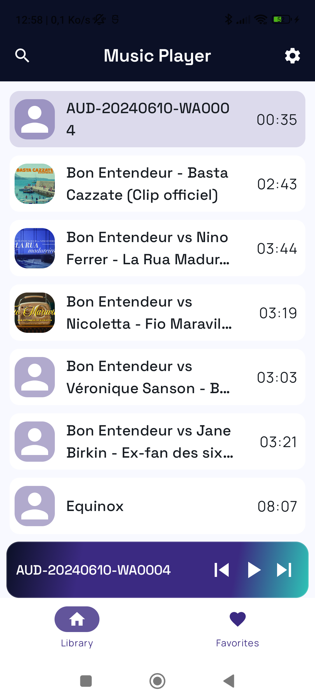
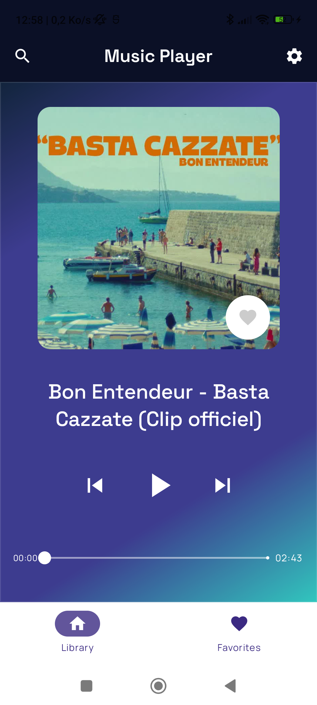
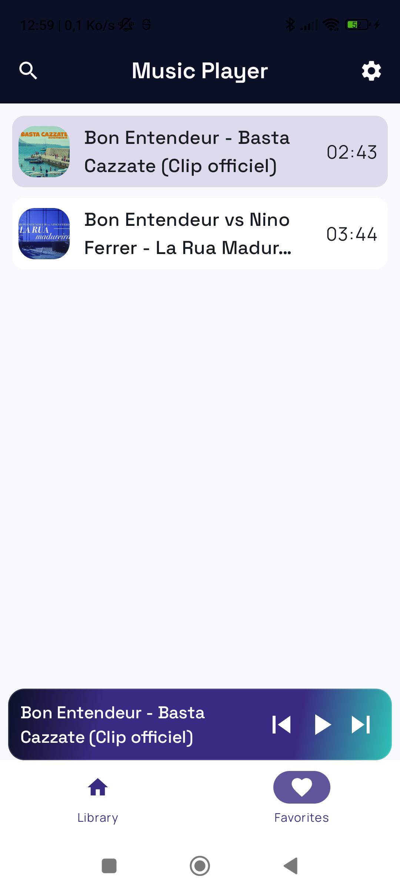
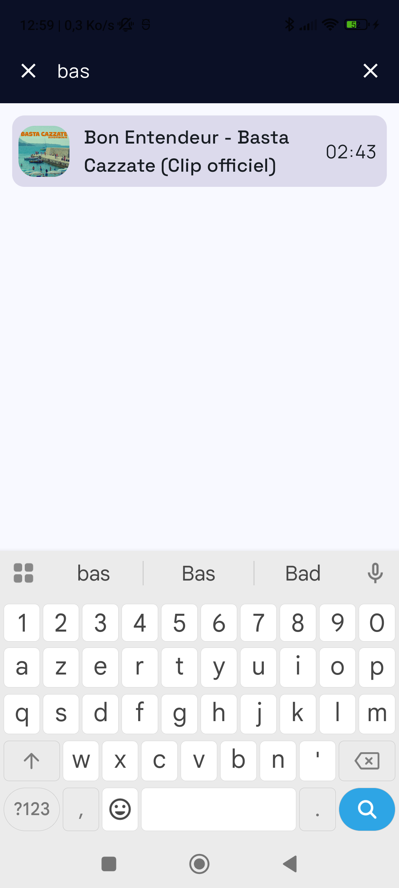

# 🎵 Music Player for Android

A modern, offline music player for local audio files, built entirely with **Jetpack Compose** and **Media3**. It scans the songs on the device, plays them in the background with a media notification, and lets you favorite and search your library — all wrapped in a custom "Aurora" dark theme.

<p>
  
  
  
  
</p>

## ✨ Features

- **Local library** — scans and lists all audio files on the device via `MediaStore`.
- **Background playback** — powered by ExoPlayer + `MediaSession`, running in a foreground service with a media notification (play/pause, next/previous from the notification and lock screen).
- **Draggable floating player** — a mini player that expands into a full-screen player with a smooth anchored-drag gesture, album art, and a seek bar.
- **Favorites** — mark any song as favorite; the choice is persisted with Proto DataStore and survives restarts. A dedicated **Favorites** tab with a friendly empty state.
- **Search** — tap the search icon in the top bar to filter the current list (Library *or* Favorites) by **title or artist**, in real time.
- **Queue-aware playback** — playing a song from a list makes that list the play queue, so *next / previous* stay within the context you started from.
- **Custom design system** — "Aurora" dark palette, bundled **Space Grotesk** (titles) + **Manrope** (body) typography, and Material Symbols (Rounded) icons shipped as lightweight vector drawables.

## 📸 Screenshots

<p align="center">
  
  
  
  
</p>

## 🏗️ Tech stack & architecture

The app follows an **MVVM / unidirectional data flow** architecture with a single-activity Compose UI.

| Concern | Choice |
|---|---|
| UI | Jetpack Compose, Material 3 |
| Playback | Media3 (ExoPlayer, MediaSession, `MediaSessionService`) |
| DI | Hilt |
| Local audio source | `MediaStore` content resolver (`MediaManager`) |
| Persistence (favorites) | Proto DataStore (`user_preferences.proto`) |
| Navigation | Navigation Compose (bottom bar: Library / Favorites) |
| Async | Kotlin Coroutines & Flow, `kotlinx.collections.immutable` |
| Images | Coil (album art) |

**Data flow.** `MainViewModel` exposes reactive state (`songs`, `favoritesSongs`, `currentPlayingSong`, playback flags) as `StateFlow`s. The song list is derived by combining the scanned tracks with the persisted favorite titles, so toggling a favorite recomposes the UI automatically. Playback commands go through a `MediaController` connected to `MusicService`.

## 📂 Project structure

```
com.francotte.contentproviderformusic
├── data/         # DataStore, UserData repository & serializer
├── di/           # Hilt modules (Data, Player, binds)
├── domain/       # FavoritesUseCase
├── model/        # Song
├── repository/   # SongsFetcherRepository (in-memory scanned songs)
├── service/      # MusicService (MediaSessionService)
├── ui/
│   ├── composable/  # Player, top bar, bottom bar, song items, empty state…
│   ├── library/     # Library route
│   ├── favorites/   # Favorites route
│   ├── navigation/  # NavHost
│   ├── state/       # MusicApp / app state
│   └── theme/       # Colors, typography (Space Grotesk + Manrope)
└── utils/        # MediaManager, PermissionManager, helpers
```

## 🚀 Getting started

### Requirements
- Android Studio (latest stable)
- **JDK 17** (required for command-line Gradle builds)
- Android SDK 35 (`compileSdk` / `targetSdk` = 35, `minSdk` = 26)
- A device or emulator with some audio files on it

### Build & run
```bash
# From Android Studio: open the project and press Run ▶

# Or from the command line (make sure JAVA_HOME points to a JDK 17):
./gradlew assembleDebug
```

### Permissions
The app requests, depending on the Android version:
- `READ_MEDIA_AUDIO` (Android 13+) / `READ_EXTERNAL_STORAGE` (older) — to read local audio
- `POST_NOTIFICATIONS` — for the media notification
- `FOREGROUND_SERVICE` / `FOREGROUND_SERVICE_MEDIA_PLAYBACK` — for background playback

## 🗺️ Roadmap

- [ ] Playlists (a third tab is scaffolded but not yet enabled)
- [ ] Shuffle & repeat modes
- [ ] Consistent "Aurora" dark background across list screens
